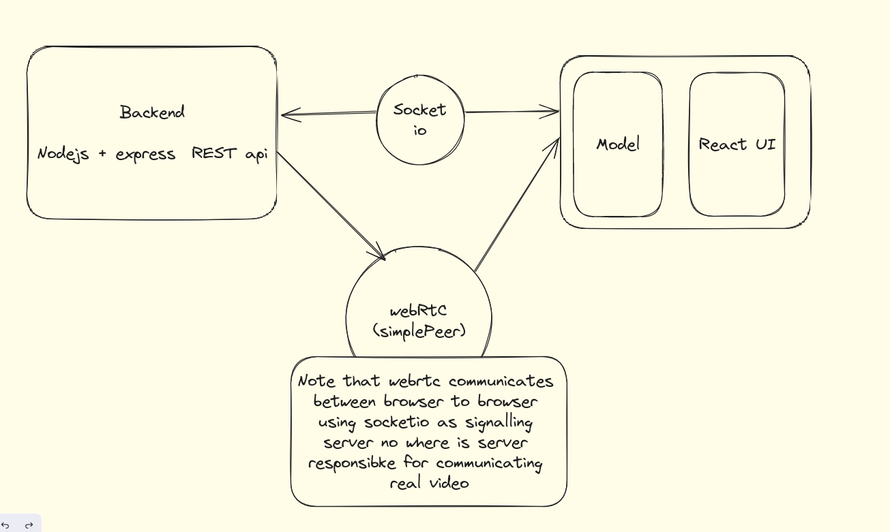
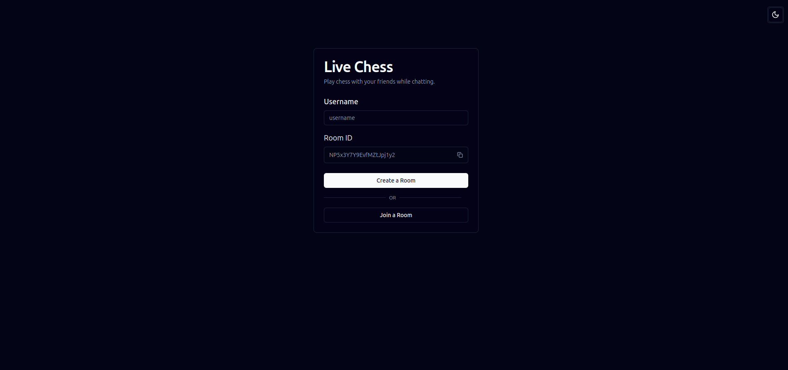
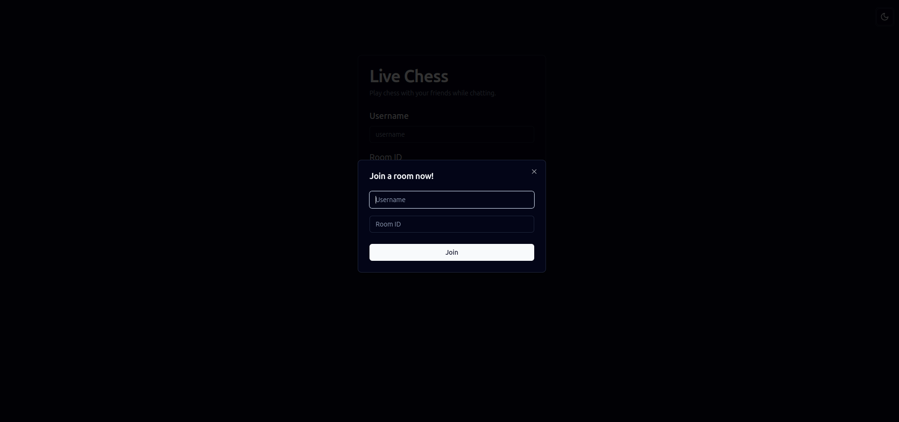
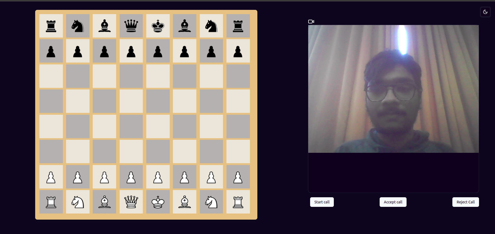

# LivechessGame

## Description
LivechessGame is a multiplayer chess game with a video chatting feature.

## Application Design

## Technologies Used
- React.js
- Shadcn UI
- Node.js
- Socket.io
- Simple Peer --[wrapper around for webRTC ]

## Features

### Create a Room Page
The create a room page allows users to initiate a new chess game session. Upon accessing this page, users can set up the parameters for the game, such as the time controls, game variant, and whether to enable video chatting during the game.

### Join a Room Page
The join a room page enables users to enter an existing chess game session. Users can either directly input a room code or browse through a list of available rooms to join. Once inside a room, users can start playing chess against the opponent and engage in video chat.

### Video Chat
The video chatting feature allows players to communicate in real-time during the chess game. Utilizing WebRTC technology through Simple Peer, users can establish peer-to-peer video connections within the chess game interface. This enhances the multiplayer gaming experience by enabling players to strategize and interact visually while playing.

